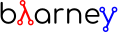

Blarney is a Haskell library for hardware description that builds a
range of HDL abstractions on top of a small set of core circuit
primitives.  It is a modern variant of
[Lava](http://citeseerx.ist.psu.edu/viewdoc/download?doi=10.1.1.110.5587&rep=rep1&type=pdf),
requiring GHC 8.6.1 or later.  Below, we introduce the library by
example, supplementing the [Haddock
docs](http://mn416.github.io/blarney/index.html).

## Contents

Examples:

* [Example 1: Two-sort](#example-1-two-sort)
* [Example 2: Bubble sort](#example-2-bubble-sort)
* [Example 3: Polymorphism](#example-3-polymorphism)
* [Example 4: Mutable registers](#example-4-mutable-registers)
* [Example 5: Queues](#example-5-queues)
* [Example 6: Mutable wires](#example-6-mutable-wires)
* [Example 7: Recipes](#example-7-recipes)
* [Example 8: Statements](#example-8-statements)
* [Example 9: Block RAMs](#example-9-block-rams)
* [Example 10: Streams](#example-10-streams)
* [Example 11: Modular compilation](#example-11-modular-compilation)
* [Example 12: Master-slave pattern](#example-12-master-slave-pattern)
* [Example 13: Bit selection and lookup](#example-13-bit-selection-and-lookup)
* [Example 14: Bit-string pattern matching](#example-14-bit-string-pattern-matching)
* [Example 15: CPUs](#example-15-cpus)
* [Example 16: Namer plugin](#example-16-namer-plugin)

Type classes:

* [Class 1: Bits](#class-1-bits)
* [Class 2: Interface](#class-2-interface)
* [Class 3: Lookup](#class-3-lookup)
* [Class 4: FShow](#class-4-fshow)

## Example 1: Two-sort

Sorting makes for a good introduction to the library.  Let's start
with perhaps the simplest kind of sorter possible: one that sorts just
two inputs.  Given a pair of 8-bit values, the function `twoSort`
returns the sorted pair.

```hs
import Blarney

twoSort :: (Bit 8, Bit 8) -> (Bit 8, Bit 8)
twoSort (a, b) = a .<. b ? ((a, b), (b, a))
```

This definition makes use of three Blarney constructs: the `Bit` type
for bit vectors (parametised by the size of the vector); the unsigned
comparison operator `.<.`; and the ternary conditional operator `?`.
A quick test bench to check that it works:

```hs
top :: Module ()
top = always do
  display "twoSort (1,2) = " (twoSort (1,2))
  display "twoSort (2,1) = " (twoSort (2,1))
  finish
```

We use Blarney's `always` construct

```hs
always :: Action a -> Module a
```

to perform the given action *on every clock cycle*.  Blarney actions
include statements for displaying values during simulation
(`display`), terminating the simulator (`finish`), and mutating state
(see below).  All statements in an `Action` execute in parallel,
within an a single cycle of an implicit clock.  We can generate
Verilog for the test bench as follows.

```hs
main :: IO ()
main = writeVerilogTop top "top" "/tmp/twoSort/"
```

Assuming the above code is in a file named `Sorter.hs`, it can be
compiled at the command-line using

```sh
> blc Sorter.hs
```

where `blc` stands for *Blarney compiler*.  This is just a script that
invokes GHC with the appropriate compiler flags.  For it to work,
the `BLARNEY_ROOT` environment variable needs to be set to the root of
the repository, and `BLARNEY_ROOT/Scripts` must be in your `PATH`.
Running the resulting executable `./Sorter` will produce Verilog in the
`/tmp/twoSort` directory, including a makefile to build a Verilator
simulator (`sudo apt-get install verilator`).  The simulator can be
built and run as follows.

```sh
> cd /tmp/twoSort
> make
> ./top
twoSort (1,2) = (01,02)
twoSort (2,1) = (01,02)
```

Looks like `twoSort` is working!

## Example 2: Bubble sort

We can build a general *N*-element sorter by connecting together
multiple two-sorters.  One of the simplest ways to do this is the
*bubble sort* network.  The key component of this network is a
function `bubble` that takes a list of inputs and returns a new list
in which the smallest element comes first (the smallest element
"bubbles" to the front).

```hs
bubble :: [Bit 8] -> [Bit 8]
bubble [] = []
bubble [x] = [x]
bubble (x:y:rest) = bubble (small:rest) ++ [large]
  where (small, large) = twoSort (x, y)
```

If we repeatedly call `bubble` then we end up with a sorted list.

```hs
sort :: [Bit 8] -> [Bit 8]
sort [] = []
sort xs = smallest : sort rest
  where smallest:rest = bubble xs
```

Running the test bench

```hs
top :: Module ()
top = always do
  let inputs = [3, 4, 1, 0, 2]
  display "sort " inputs " = " (sort inputs)
  finish
```

in simulation yields:

```
sort [03,04,01,00,02] = [00,01,02,03,04]
```

To see that the `sort` function really is describing a circuit, let's
draw the circuit digram for a 5-element bubble sorter.

```
        -->.
           |
        -->+---.
           |   |
Inputs  -->+---+---.
           |   |   |
        -->+---+---+---.
           |   |   |   |
        -->+---+---+---+---.
           |   |   |   |   |
           v   v   v   v   v

                Outputs
```

The input list is supplied on the left, and the sorted output list is
produced at the bottom.  Each `+` denotes a two-sorter that takes
inputs from the top and the left, and produces the smaller value to
the bottom and the larger value to the right.

See [The design and verification of a sorter
core](https://pdfs.semanticscholar.org/de30/22efc5aec833d7b52bd4770a382fea729bba.pdf)
for a more in-depth exploration of sorting circuits in Haskell.

## Example 3: Polymorphism

For simplicity, we've made our sorter specific to lists of 8-bit
values.  But if we look at the types of the primitive functions it
uses, we can see that it actually has a more general type.

```hs
(.<.) :: Cmp a  => a -> a -> Bit 1
(?)   :: Bits a => Bit 1 -> (a, a) -> a
```

So `.<.` can be used on any type in the
[Cmp](http://mn416.github.io/blarney/Blarney-Core-Bit.html#t:Cmp)
(comparator) class.  Similarly `?` can be used on any type in the
[Bits](#class-1-bits) class (which allows packing to a bit vector and
back again). So a more generic definition of `twoSort` would be:

```hs
twoSort :: (Bits a, Cmp a) => (a, a) -> (a, a)
twoSort (a, b) = a .<. b ? ((a, b), (b, a))
```

Indeed, this would be the type inferred by the Haskell compiler if no
type signature was supplied.  We can also use `if`-`then`-`else`
instead of the ternary conditional operator:

```hs
twoSort :: (Bits a, Cmp a) => (a, a) -> (a, a)
twoSort (a, b) = if a .<. b then (a, b) else (b, a)
```

## Example 4: Mutable registers

So far, we've only seen `display` and `finish` actions inside a
Blarney module.  Also supported are creation and assignment of
registers.  To illustrate, here is a module that creates a 4-bit
`cycleCount` register, increments it on each cycle, stopping when it
reaches 10.

```hs
top :: Module ()
top = do
  -- Create a register
  cycleCount :: Reg (Bit 4) <- makeReg 0

  always do
    -- Increment on every cycle
    cycleCount <== cycleCount.val + 1

    -- Display value on every cycle
    display "cycleCount = %0d" (cycleCount.val)

    -- Terminate simulation when count reaches 10
    when (cycleCount.val .==. 10) do
      display "Finished"
      finish
```

This example introduces a number of new library functions: `makeReg`
creates a register, initialised to the given value; `val` returns the
value of a register; the `.` operator is defined by Blarney as
*reverse function application* rather than the usual *function
composition*; and `when` allows conditional actions to be introduced.
In addition to `when`, we can also use `if`-`then`-`else` in an
`Action` context.  For example, the final three lines above could have
been written as:

```hs
  -- Terminate simulation when count reaches 10
  if cycleCount.val .==. 10
    then do
      display "Finished"
      finish
    else
      display "Not finished"
```

Running `top` in simulation gives

```
cycleCount = 0
cycleCount = 1
cycleCount = 2
cycleCount = 3
cycleCount = 4
cycleCount = 5
cycleCount = 6
cycleCount = 7
cycleCount = 8
cycleCount = 9
cycleCount = 10
Finished
```

## Example 5: Queues

Queues (also known as FIFOs) are a commonly used abstraction in hardware
design.  Blarney provides [a range of different queue
implementations](http://mn416.github.io/blarney/Blarney-Queue.html),
all of which implement the following interface available when importing
`Blarney.Queue`.

```hs
-- Queue interface
data Queue a =
  Queue {
    notEmpty :: Bit 1           -- Is the queue non-empty?
  , notFull  :: Bit 1           -- Is there any space in the queue?
  , enq      :: a -> Action ()  -- Insert an element (assuming notFull)
  , deq      :: Action ()       -- Remove the first element (assuming canDeq)
  , canDeq   :: Bit 1           -- Guard on the deq and first methods
  , first    :: a               -- View the first element (assuming canDeq)
  }
```

The type `Queue a` represents a queue holding elements of type `a`,
and provides a range of standard functions on queues.  The `enq`
method should only be called when `notFull` is true and the `deq`
method should only be called when `canDeq` is true.  Similarly, the
`first` element of the queue is only valid when `canDeq` is true.
Below, we present the simplest possible implementation of a
one-element queue.

```hs
import Blarney.Queue

-- Simple one-element queue implementation
makeSimpleQueue :: Bits a => Module (Queue a)
makeSimpleQueue = do
  -- Register holding the one element
  reg :: Reg a <- makeReg dontCare

  -- Register defining whether or not queue is full
  full :: Reg (Bit 1) <- makeReg 0

  -- Methods
  let notFull  = full.val .==. 0
  let notEmpty = full.val .==. 1
  let enq a    = do reg <== a
                    full <== 1
  let deq      = full <== 0
  let canDeq   = full.val .==. 1
  let first    = reg.val

  -- Return interface
  return (Queue notEmpty notFull enq deq canDeq first)
```

The following simple test bench illustrates how to use a queue.

```hs
-- Small test bench for queues
top :: Module ()
top = do
  -- Instantiate a queue of 8-bit values
  queue :: Queue (Bit 8) <- makeSimpleQueue

  -- Create an 8-bit count register
  count :: Reg (Bit 8) <- makeReg 0

  always do
    count <== count.val + 1

    -- Writer side
    when (queue.notFull) do
      enq queue (count.val)
      display "Enqueued " (count.val)

    -- Reader side
    when (queue.canDeq) do
      deq queue
      display "Dequeued " (queue.first)

    -- Terminate after 100 cycles
    when (count.val .==. 100) finish
```

## Example 6: Mutable wires

*Wires* are a feature of the `Action` monad that offer a way for
separate action blocks to communicate *within the same clock cycle*.
Whereas assignment to a register becomes visible on the clock cycle
after the assigment occurs, assignment to a wire is visible on the
same cycle as the assignment.  If no assignment is made to a wire on a
particular cycle, then the wire emits its *default value* on that
cycle.  When multiple assignments to the same wire occur on the same
cycle, the wire emits the bitwise disjunction of all the assigned
values.

To illustrate, let's implement an *n*-bit counter module that supports
increment and decrement operations.

```hs
-- Interface for a n-bit counter
data Counter n =
  Counter {
    inc    :: Action ()
  , dec    :: Action ()
  , output :: Bit n
  }
```

We'd like the counter to support *parallel calls* to `inc` and `dec`.
That is, if `inc` and `dec` are called on the same cycle then the
counter's `output` is unchanged.  We'll achieve this using wires.

```hs
makeCounter :: KnownNat n => Module (Counter n)
makeCounter = do
  -- State
  count :: Reg (Bit n) <- makeReg 0

  -- Wires
  incWire :: Wire (Bit 1) <- makeWire 0
  decWire :: Wire (Bit 1) <- makeWire 0

  always do
    -- Increment
    when (incWire.val .&. decWire.val.inv) do
      count <== count.val + 1

    -- Decrement
    when (incWire.val.inv .&. decWire.val) do
      count <== count.val - 1

  -- Interface
  let inc    = incWire <== 1
  let dec    = decWire <== 1
  let output = count.val

  return (Counter inc dec output)
```

## Example 7: Recipes

State machines are a common way of defining the control-path of a
circuit.  They are typically expressed by doing case-analysis of the
current state and manually setting the next state.  Quite often
however, they can be expressed more neatly in a
[Recipe](http://mn416.github.io/blarney/Blarney-Recipe.html)
-- a simple imperative language with various control-flow constructs.

```hs
data Recipe =
    Skip                         -- Do nothing (in zero cycles)
  | Tick                         -- Do nothing (in one cycle)
  | Action (Action ())           -- Perform action (in one cycle)
  | Seq [Recipe]                 -- Execute recipes in sequence
  | Par [Recipe]                 -- Fork-join parallelism
  | Wait (Bit 1)                 -- Block until condition holds
  | When (Bit 1) Recipe          -- Conditional recipe
  | If (Bit 1) Recipe Recipe     -- If-then-else recipe
  | While (Bit 1) Recipe         -- Loop
  | Background Recipe            -- Run recipe in background
```

To illustrate, here is a small state machine that computes the
factorial of 10.

```hs
fact :: Module ()
fact = do
  -- State
  n   :: Reg (Bit 32) <- makeReg 0
  acc :: Reg (Bit 32) <- makeReg 1

  -- Compute factorial of 10
  let recipe =
        Seq [
          Action do
            n <== 10
        , While (n.val .>. 0) (
            Action do
              n <== n.val - 1
              acc <== acc.val * n.val
          )
        , Action do
            display "fact(10) = %0d" (acc.val)
            finish
        ]
       
  runRecipe recipe 
```

Blarney provides a lightweight compiler for the `Recipe` language
(under 100 lines of code), which we invoke above through the call to
`runRecipe`.

A very common use of recipes is to define test sequences.  For
example, here is a simple test sequence for the `Counter` module
defined earlier.

```hs
-- Test-bench for a counter
top :: Module ()
top = do
  -- Instantiate an 4-bit counter
  counter :: Counter 4 <- makeCounter

  -- Sample test sequence
  let test =
        Seq [
          Action do
            counter.inc
        , Action do
            counter.inc
        , Action do
            counter.inc
            counter.dec
        , Action do
            display "counter = %0d" (counter.output)
            finish
        ]

  runRecipe test
```

Here, we increment `counter` on the first cycle, and then again on the
second.  On the third cycle, we both increment and decrement it in
parallel.  On the fourth cycle, we display the value and terminate the
simulator.

## Example 8: Statements

For convenience, recipes can also be constucted using `do` notation.
The [Stmt](http://mn416.github.io/blarney/Blarney-Stmt.html) monad is
simply a wrapper around `Recipe`, which defines monadic bind as
sequential composition.  It is entirely syntatic sugar, providing no
new functionality.

To illustrate, here's the factoral example from earlier, rewritten
using the `Stmt` monad.

```hs
fact :: Module ()
fact = do
  -- State
  n   :: Reg (Bit 32) <- makeReg 0
  acc :: Reg (Bit 32) <- makeReg 1

  -- Compute factorial of 10
  let stmt = do
        action do
          n <== 10
        while (n.val .>. 0) do
          action do
            n <== n.val - 1
            acc <== acc.val * n.val
        action do
          display "fact(10) = %0d" (acc.val)
          finish

  runStmt stmt
```

We have found that some users prefer `Recipe` syntax, while others
prefer `Stmt` syntax, so we offer both.

## Example 9: Block RAMs

Blarney provides
[a variety of block RAM
modules](http://mn416.github.io/blarney/Blarney-Core-RAM.html)
commonly supported on FPGAs.
They are all based around the following interface.

```hs
-- Block RAM interface
-- (Parameterised by the address width a and the data width d)
data RAM a d =
  RAM {
    load    :: a -> Action ()
  , store   :: a -> d -> Action ()
  , out     :: d
  }
```

When a `load` is issued for a given address, the value at that address
appears on `out` on the next clock cycle.  When a `store` is issued,
the value is written to the RAM on the current cycle, and a load of
the new value can be requested on the subsequent cycle.  A parallel
`load` and `store` should only be issued on the same cycle if the RAM
has been created as a dual-port RAM (as opposed to a single-port RAM).
To illustrate, here is a test bench that creates a single-port block
RAM and performs a `store` followed by a `load`.

```hs
top :: Module ()
top = do
  -- Instantiate a 256 element RAM of 5-bit values
  ram :: RAM (Bit 8) (Bit 5) <- makeRAM

  -- Write 10 to ram[0] and read it back again
  runStmt do
    action do
      store ram 0 10
    action do
      load ram 0
    action do
      display "Got 0x%0x" (ram.out)
      finish
```

Somewhat-related to block RAMs are
[register files](http://mn416.github.io/blarney/Blarney-Core-Module.html#t:RegFile).
The difference
is that a register file allows the value at an address to be
determined *within* a clock cycle.  It also allows any number of reads
and writes to be performed within the same cycle.  Register files have
the following interface.

```hs
data RegFile a d =
  RegFile {
    index  :: a -> d                -- Read
  , update :: a -> d -> Action()    -- Write
  }
```

To read from a register file, use the `index` method or the generic
lookup operator `!`.  Unlike block RAMs, register files (especially
large ones) do not always map efficiently onto hardware, so use with
care!

## Example 10: Streams

Streams are another commonly-used abstraction in hardware description.
They are often used to implement hardware modules that consume data at
a *variable rate*, depending on internal details of the module that
the implementer does not wish to (or is unable to) expose.  In
Blarney,
[streams](file:///home/mn416/work/mn416.github.io/blarney/Blarney-Stream.html)
are captured by the following interface.

```hs
type Stream a = Source a

data Source a =
  Source {
    canPeek :: Bit 1
  , peek    :: a
  , consume :: Action ()
  }
```

Streams are closely related to queues.  Indeed, any queue can be
converted to a stream:

```hs
-- Convert a queue to a stream
toStream :: Queue a -> Stream a
toStream q =
  Source {
    canPeek  = q.canDeq
  , peek     = q.first
  , consume  = deq q
  }
```

As an example, here's a function that increments each value in the
input stream to produce the output stream.

```hs
inc :: Stream (Bit 8) -> Module (Stream (Bit 8))
inc xs = do
  -- Output buffer
  buffer <- makeQueue

  always do
    -- Incrementer
    when (xs.canPeek .&. buffer.notFull) do
      consume xs
      enq buffer (xs.peek + 1)

  -- Convert buffer to a stream
  return (buffer.toStream)
```

## Example 11: Modular compilation

So far we've seen examples of top-level modules, i.e. modules with no
inputs or outputs, being converted to Verilog.  In fact, any Blarney
function whose inputs and outputs are members of the
[Interface](http://mn416.github.io/blarney/Blarney-Core-Interface.html) class
can be converted to Verilog (and the `Interface` class supports
generic deriving).  To illustrate, we can convert the function `inc`
(defined in [Example 10](#example-10-streams)) into a Verilog module
as follows.

```hs
main :: IO ()
main = writeVerilogModule inc "inc" "/tmp/inc"
```

The generated Verilog module `/tmp/inc/inc.v` has the following
interface:

```sv
module inc(
  input  wire clock
, output wire [0:0] in0_consume_en
, input  wire [0:0] in0_canPeek
, input  wire [7:0] in0_peek
, input  wire [0:0] out_consume_en
, output wire [7:0] out_peek
, output wire [0:0] out_canPeek
);
```

Considering the definition of the `Stream` type, the correspondance
between the Blarney and the Verilog is quite clear:

Signal            | Description
------            | -----------
`in0_consume_en`  | Output asserted whenever the module consumes an element from the input stream.
`in0_canPeek`     | Input signalling when there is data available in the input stream.
`in0_peek`        | Input containing the next value in the input stream.
`out_canPeek`     | Output asserted whenever there is data available in the output stream.
`out_peek`        | Output containing the next value in the output stream.
`out_consume_en`  | Input signalling when the caller consumes an element from the output stream.

It is also possible to instantiate a Verilog module inside a Blarney
description.  To illustrate, here is a function that creates an
instance of the Verilog `inc` module shown above.

```hs
-- This function creates an instance of a Verilog module called "inc"
makeInc :: Stream (Bit 8) -> Module (Stream (Bit 8))
makeInc = makeInstance "inc"
```

Notice that interface of the Verilog module being instantiated is
determined from the type signature.  Here's a sample top-level module
that uses the `makeInc` function:

```hs
top :: Module ()
top = do
  -- Counter
  count :: Reg (Bit 8) <- makeReg 0

  -- Input buffer
  buffer <- makeQueue

  -- Create an instance of inc
  out <- makeInc (buffer.toStream)

  always do
    -- Fill input
    when (buffer.notFull) do
      enq buffer (count.val)
      count <== count.val + 1

    -- Consume
    when (out.canPeek) do
      consume out
      display "Got 0x%0x" (out.peek)
      when (out.peek .==. 100) finish
```

Using the following `main` function we can generate both the `inc`
module and a top-level module that instantiates it.

```hs
main :: IO ()
main = do
  let dir = "/tmp/inc"
  writeVerilogModule inc "inc" dir
  writeVerilogTop top "top" dir
```

Using this approach, we can maintain the module hierarchy of a Blarney
design whenever we generate Verilog, rather than having to flatten it
to massive netlist.  This technique can also be used to instantaite
any Verilog module within a Blarney design.

## Example 12: Master-slave pattern

This is a common pattern in hardware design.  Suppose we wish to move
multiplication out of a module and into an separate slave module,
where the slave takes requests (pairs of 32-bit integers to multiply)
and produces responses (32-bit results).

```hs
type MulReq  = (Bit 32, Bit 32)
type MulResp = Bit 32
```

The slave component might be defined as:

```hs
slave :: Stream MulReq -> Module (Stream MulResp)
slave reqs = do
  resps <- makeQueue

  always do
    when (reqs.canPeek .&. resps.notFull) do
      consume reqs
      let (a, b) = reqs.peek
      enq resps (a * b)

  return (resps.toStream)
```

The master component produces requests for the slave, and consumes
responses from the slave.  In the example below, the master simply
asks the slave to multiply 2 by 2, waits for the response, and then
terminates the simulation.

```hs
master :: Stream MulResp -> Module (Stream MulReq)
master resps = do
  reqs <- makeQueue

  runStmt do
    wait (reqs.notFull)
    action do
      enq reqs (2, 2)
    wait (resps.canPeek)
    action do
      resps.consume
      display "Result: %0d" (resps.peek)
      finish

  return (reqs.toStream)
```

The top-level module which connects the master and the slave needs to
introduce a cycle, which can be achieved simply using Haskell's
recursive-do (`mdo`) notation:

```hs
top :: Module ()
top = mdo
  resps <- slave reqs
  reqs <- master resps
  return ()
```

## Example 13: Bit selection and lookup

Bit selection operators are used to extract a subset of bits out of a
bit-vector.  There are different flavours, depending on whether the
indices are *type-level* numbers, *elaboration-time* numbers, or
*circuit-level* numbers.

For type-level indices, we provide functions
[at](http://mn416.github.io/blarney/Blarney-Core-Bit.html#v:at) and
[slice](http://mn416.github.io/blarney/Blarney-Core-Bit.html#v:slice), and
use type application to specify the type-level indices:

```hs
-- Extract most-sigificant bit of a byte
msb :: Bit 8 -> Bit 1
msb x = at @7 x

-- Extract upper 4 bits of a byte
upperNibble :: Bit 8 -> Bit 4
upperNibble x = slice @7 @4 x
```

For elaboration-time indices of type `Int`, we provide
[unsafeAt](http://mn416.github.io/blarney/Blarney-Core-Bit.html#v:unsafeAt) and
[unsafeSlice](http://mn416.github.io/blarney/Blarney-Core-Bit.html#v:unsafeSlice):

```hs
-- Extract most-sigificant bit of a byte
msb :: Bit 8 -> Bit 1
msb x = unsafeAt 7 x

-- Extract upper 4 bits of a byte
upperNibble :: Bit 8 -> Bit 4
upperNibble x = unsafeSlice (7, 4) x
```

The argument to `unsafeAt` could be out of range, and the result of
`unsafeSlice` could have a different width to that implied by the
range.  Such cases will lead to confusing error messages, hence the
"unsafe" prefix on the function names.

Finally, for circuit-level indicies of type `Bit n`, the generic
lookup operator `!` can be used:

```hs
-- Extract bit from byte at given index
getBit :: Bit 8 -> Bit 3 -> Bit 1
getBit x i = x!i
```

Blarney's generic lookup operator `x!i` returns the `i`'th element of
`x`, and works for many different types of `x` and `i`.  See the
[Lookup class](#class-3-lookup) for more details.

## Example 14: Bit-string pattern matching

Recent work on specifying and implementing ISAs led us to develop two
libraries for doing bit-string pattern matching.  The first,
[BitPat](http://mn416.github.io/blarney/Blarney-BitPat.html),
is statically-typed and based on the paper [Type-safe pattern
combinators](https://core.ac.uk/download/pdf/50525461.pdf).
The second,
[BitScan](http://mn416.github.io/blarney/Blarney-BitScan.html),
is dynamically typed but more expressive.
As an example, `BitScan`,
let's us define the following instruction decoder for a tiny subset of
RISC-V.

```hs
import Blarney.BitScan

-- Semantics of add instruction
add :: Bit 5 -> Bit 5 -> Bit 5 -> Action ()
add rs2 rs1 rd =
  display "add r%0d" (rd.val) ", r%0d" (rs1.val) ", r%0d" (rs2.val)

-- Semantics of addi instruction
addi :: Bit 12 -> Bit 5 -> Bit 5 -> Action ()
addi imm rs1 rd =
  display "add r%0d" (rd.val) ", r%0d" (rs1.val) ", 0x%0x" (imm.val)

-- Semantics of store-word instruciton
sw :: Bit 12 -> Bit 5 -> Bit 5 -> Action ()
sw imm rs2 rs1 = display "sw r%0d" rs2 ", %0d(r%0d)" imm rs1

top :: Module ()
top = always do
  -- Sample RISC-V store-word instruction
  let instr :: Bit 32 = 0b1000000_00001_00010_010_00001_0100011

  -- Dispatch
  match instr
    [
      "0000000   rs2[4:0]  rs1[4:0] 000 rd[4:0]  0110011" ==> add,
      "          imm[11:0] rs1[4:0] 000 rd[4:0]  0010011" ==> addi,
      "imm[11:5] rs2[4:0]  rs1[4:0] 010 imm[4:0] 0100011" ==> sw
    ]

  finish
```

The nice thing about this decoder is that the *scattered immediate*
field `imm` in the `sw` instruction is automatically assembled by the
library.  That is, the `imm[11:5]` part of the immediate is combined
with the `imm[4:0]` part to give the final 12-bit immediate value
passed to the right-hand-side function.  Scattered immediates appear a
lot in the RISC-V specification.  Thanks to Jon Woodruff for
suggesting this feature!

## Example 15: CPUs

A few processor cores have been implemented in Blarney:

* [Simple](https://github.com/mn416/blarney/blob/master/Examples/CPU/CPU.hs):
4-stage 8-bit CPU, with just 4 instructions, which resolves
both control and data hazards.
* [Pebbles](https://github.com/mn416/blarney/blob/master/Examples/Pebbles/):
5-stage 32-bit RISC-V core separating the ISA from the pipeline
microarchitecture.
* [Actora](https://github.com/POETSII/actora/): 3-stage stack
machine that runs code written a subset of Erlang.

## Example 16: Namer plugin

One of the classic limitations of Lava is that identifier names are
lost when the netlist is generated.  In particular, this is
problematic when you want to analyse, say, the critical-path of your
circuit using a third-party tool, but there is no way to map the
netlist names reported by the tool back to the Lava names in your
original description.

Blarney provides a solution to this problem in the form of the [Namer
plugin](Haskell/BlarneyPlugins/Namer).  This is a simple GHC plugin
(around 150 lines of code) that looks for monadic bindings of the form

```hs
  x <- m
```

where `m` has type `Module a` for any `a`, and automatically rewrites
the binding as

```hs
  x <- withName "x" m
```

where
[withName](http://mn416.github.io/blarney/Blarney-Core-Module.html#v:withName)
is a Blarney primitive that introduces name information inside `m`
This simple approach captures quite a lot of useful names.

The plugin is *completely optional*, and disabled by default.  To
enable it, first install using cabal

```
cd Haskell/BlarneyPlugins/Namer
cabal install
```

and then pass the `--enable-namer-plugin` flag to `blc`.

To further improve the readability of generated code, you can also
pass the `--enable-name-prop` and `--enable-simplifier` options to
your circuit generator.  This will enable the (experimental) name
propagation and netlist simplification passes respectively.

## Class 1: Bits

Any type in the
[Bits](http://mn416.github.io/blarney/Blarney-Core-Bits.html)
class can be represented in hardware, e.g.
stored in a wire, a register, or a RAM.

```hs
class Bits a where
  type SizeOf a :: Nat
  sizeOf        :: a -> Int
  pack          :: a -> Bit (SizeOf a)
  unpack        :: Bit (SizeOf a) -> a
```

The `Bits` class supports *generic deriving*.  For example, suppose
we have a simple data type for memory requests:

```hs
data MemReq =
  MemReq {
    memOp   :: Bit 1    -- Is it a load or a store request?
  , memAddr :: Bit 32   -- 32-bit address
  , memData :: Bit 32   -- 32-bit data for stores
  }
  deriving (Generic, Bits)
```

To make this type a member of the `Bits` class, we have suffixed it
with `derving (Generic, Bits)`.  The generic deriving mechanism for
`Bits` does not support *sum types*: there is no way to convert a
bit-vector (run-time circuit value) to a sum type (elaboration-time
value) using the circuit primitives provided by Blarney.

## Class 2: Interface

Any type in the
[Interface](http://mn416.github.io/blarney/Blarney-Core-Interface.html)
class can be used as a module input or output when doing [modular
compilation](#example-11-modular-compilation).  Furthermore,
collections of interfaces can be indexed by circuit-time values using
the `!` operator.  To illustrate, here is an example circuit to split
a stream of [MemReq](#class-1-bits) into four streams, using the lower
two bits of the address to decide which output stream to use.

```hs
split :: Stream MemReq -> Module [Stream MemReq]
split reqs = do
  -- Create a list of 4 queues
  queues :: [Queue MemReq] <- replicateM 4 makeQueue

  always do
    -- Consume request, and put into appropriate queue
    when (reqs.canPeek) do
      let i :: Bit 2 = truncate (reqs.peek.memAddr)
      when ((queues!i).notFull) do
        reqs.consume
        enq (queues!i) (reqs.peek)

  return (map toStream queues)
```

The `Interface` class supports generic deriving: just add `Interface`
to the deriving clause for the datatype.  In the above example,
`MemReq` is an `Interface`, and so too is `Queue a` for any `a` that
is also an `Interface`.

## Class 3: Lookup

The generic lookup operator `!` is provided by the
[Lookup](http://mn416.github.io/blarney/Blarney-Core-Lookup.html)
class.

```hs
-- Index a collection 'c' of elements 'e' using index 'i' 
class Lookup c i e | c -> e where
  (!) : c -> i -> e
```

A wide range of combinations of types are supported.  The functional
dependency `c -> e` allows the return type to be inferred from the
collection type.

## Class 4: FShow

Any type in the
[FShow](http://mn416.github.io/blarney/Blarney-Core-FShow.html)
class can be passed as arguments to the
variadic `display` function.

```hs
class FShow a where
  fshow     :: a -> Format
  fshowList :: [a] -> Format     -- Has default definition

-- Abstract data type for things that can be displayed
newtype Format

-- Format constructors
mempty :: Format                         -- Empty (from Monoid class)
(<>)   :: Format -> Format -> Format     -- Append (from Monoid class)
```

As an example, here is how the `FShow` instance for pairs is defined.

```hs
-- Example instance: displaying pairs
instance (FShow a, FShow b) => FShow (a, b) where
  fshow (a, b) = fshow "(" <> fshow a <> fshow "," <> fshow b <> fshow ")"
```

The `FShow` class supports generic deriving.
